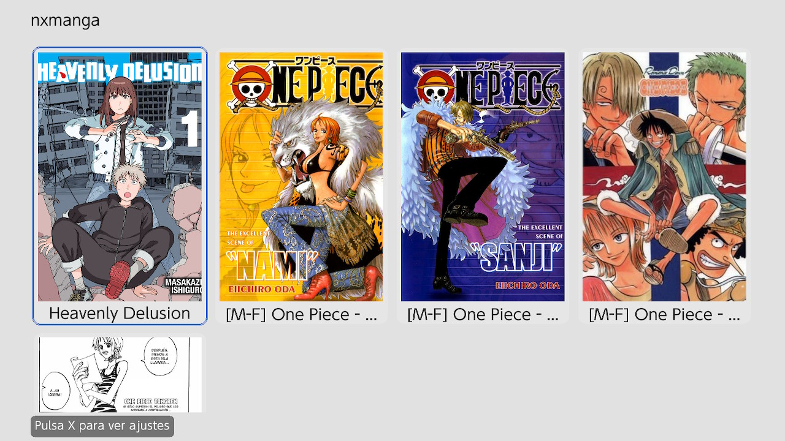
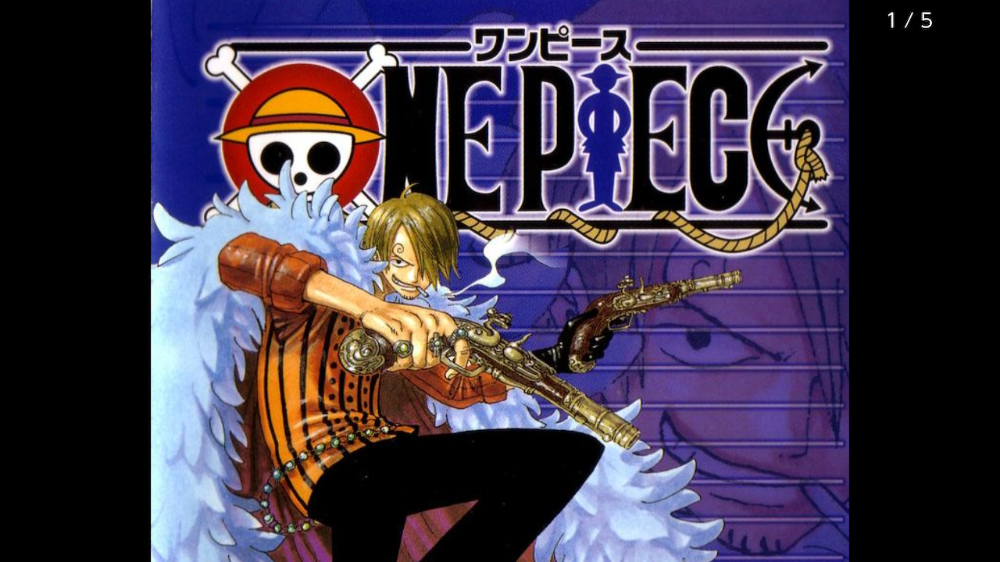
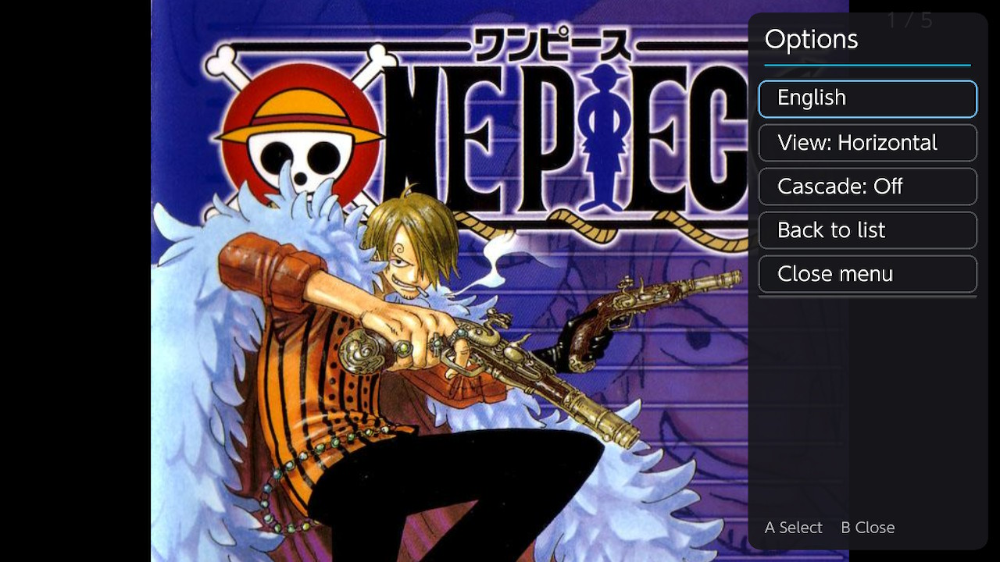
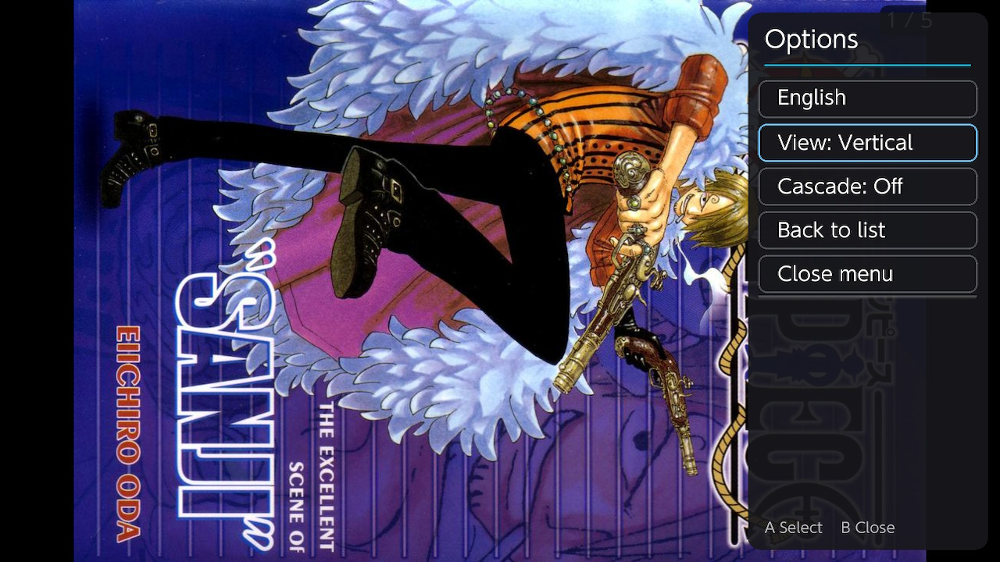

<p align="center">
  
</p>

<h1 align="center">nxmanga</h1>

<p align="center">
  A homebrew manga reader for Nintendo Switch, built with <a href="https://github.com/XorTroll/Plutonium">Plutonium</a>.
</p>

## Features

- **Library grid** — browse your manga collection as a grid of covers, organized however you already have it on your SD card: single chapters, or series folders containing multiple chapters. Sorting coming soon...
- **CBZ/ZIP and loose image folders** — a manga/chapter can be a `.cbz`/`.zip` archive, or a plain folder of `.jpg`/`.jpeg`/`.png`/`.webp` images.
- **Reading progress, remembered automatically** — reopening a chapter picks up exactly where you left off. Chapters you've finished show a tick on their cover; chapters you've started but not finished show a `current/total` page badge. A series folder shows the tick once every chapter inside it is done.
- **Two reading modes** — flip page by page, or switch to a continuous vertical **cascade** (webtoon-style) scroll.
- **Horizontal/vertical orientation** — read normally, or rotate the console on its side for an e-reader-like vertical layout.
- **Zoom & pan** — pinch-to-zoom (touch) or right stick, drag/left-stick to pan, in both reading modes.
- **Touch and button controls** — fully playable with the touchscreen, the D-pad/sticks, or both.
- **Multi-language UI** — currently English and Spanish; cycle languages from the side menu.

## Screenshots

<table>
  <tr>
    <td align="center"><br><sub>Library grid</sub></td>
    <td align="center"><br><sub>Reading a page</sub></td>
  </tr>
  <tr>
    <td align="center"><br><sub>Reader options — horizontal</sub></td>
    <td align="center"><br><sub>Reader options — vertical</sub></td>
  </tr>
</table>

## Installing manga

Copy your manga into `sdmc:/manga` on your SD card. Each entry directly under it can be either:

- a **single chapter/one-shot**: a `.cbz`/`.zip` file, or a folder of loose image files, shown and opened directly; or
- a **series folder**: a folder containing further chapters (each a `.cbz`/`.zip` or an image folder, following the same rule), which nxmanga will browse as its own sub-list.

```
sdmc:/manga/
├── Some One-Shot.cbz
├── Some Series/
│   ├── Chapter 1.cbz
│   ├── Chapter 2.cbz
│   └── ...
└── Another Series (loose images)/
    ├── Chapter 1/
    │   ├── 001.jpg
    │   └── ...
    └── Chapter 2/
        └── ...
```

## Controls

Almost the whole flow can be done with just the touchscreen, though a few actions (going back, opening the side menu, cycling fit mode) still need a physical button — there's no touch equivalent for those yet.

| Action | Buttons/sticks | Touch |
| --- | --- | --- |
| Move selection / scroll the library | D-pad / left stick | Drag |
| Open a manga or chapter, confirm a side menu option | A | Tap |
| Go back | B | — |
| Previous / next page (single-page mode) | L / R | Tap the left/right half of the screen |
| Scroll (cascade mode) | L / R (jump a screen), left stick | Drag |
| Pan a zoomed-in page (single-page mode) | Left stick | Drag |
| Zoom | Right stick | Pinch |
| Cycle fit mode (single-page mode) | Y | — |
| Open the side menu (settings, language, mark as read/unread) | X | — |

## Building from source

Requires [devkitPro](https://devkitpro.org/) with the `switch-dev` package (devkitA64 + libnx) installed and on `DEVKITPRO`. Plutonium is included as a git submodule under `libs/Plutonium`.

```sh
git clone --recursive https://github.com/davidabejon/nxmanga.git
cd nxmanga
make
```

This produces `nxmanga.nro`, ready to copy to `sdmc:/switch/` and launch from the Homebrew Menu.
